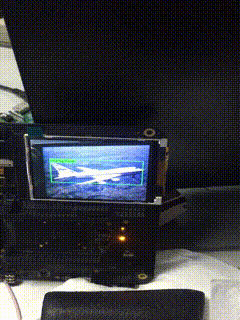

# K210 YOLO_V2 FACE DETECTION

My multi-class detection of Yolo V2 based on mobilenet has been successful, So I released this one-class detection code based on Yolo V2. You can use my code to train face detection model or other model.


# FDDB FACE

## Download dataset

```sh
wget http://tamaraberg.com/faceDataset/originalPics.tar.gz
mkdir FDDB
tar -zxvf originalPics.tar.gz -C FDDB
wget http://vis-www.cs.umass.edu/fddb/FDDB-folds.tgz
tar -zxvf FDDB-folds.tgz -C FDDB
```

## Make DataSet List

Please modify the `make_fddb_list.py` line 7 `fddb_path = '/media/zqh/Datas/DataSet/FDDB'` to your dataset path, Then:

```sh
python3 make_fddb_list.py
```


## Make Anchor List

First extract all annotations.

```sh
python3 get_all_annotations.py data/fddb_ann.list
```

It will save all annotations to `tmp/all.txt`, Then use kmeans find the anchors:

```sh
python3 make_anchor_list.py tmp/all.txt data/fddb_anchors.list
```

**NOTE：** 
-   output file name should be `${datasetname}_anchors.list`
-   if use other dataset, should use `python3 make_anchor_list.py tmp/all.txt data/fddb_anchors.list --is_random=True`
-   when `--is_random=True`, may be unsuccessful , just repeat it several times.

Now generate the `data/fddb_anchors.list`

## Train Faces detection

```sh
make train MODEL=mobile_yolo MAXEP=20 ILR=0.001 DATASET=fddb CLSNUM=1 IAA=False CLASSIFIER=True BATCH=32
```

we can continue training

```sh
make train MODEL=mobile_yolo MAXEP=40 ILR=0.0005 DATASET=fddb CLSNUM=1 IAA=True CLASSIFIER=False BATCH=32 CKPT=log/xxxxx
```

and you can use `tensorboard --logdir log` to look plot

## Freeze Graph

```sh
make freeze MODEL=mobile_yolo CKPT=log/xxxxxxx CLSNUM=1 DATASET=fddb
```

now we have Freeze_save.pb

## Inferernce

```sh
make inference CLSNUM=1 IMG=data/timg.jpg DATASET=fddb
```

## Convert PB to .C Code

```sh
make kmodel_convert
```

## Compile C Code

```sh
cp xxxxx/kendryte-model-compiler/build/gencode_output.c kpu_yolo_v2
```

If you modify the anchor value, you have to modify the `kpu_yolo_v2/main.c line 47`,then you can use the [kendryte model compiler](https://github.com/kendryte/kendryte-model-compiler) to compile. and use  [kendryte standalone sdk](https://github.com/kendryte/kendryte-standalone-sdk) version: v0.5.4 


## Download .bin

My KD233 board was damaged by squirrels :( 
    
So now I am using the [Maix Go](https://maixpy.sipeed.com/zh/hardware/board.html), Then use the new [Kflash](https://github.com/sipeed/kflash.py)

```sh
liciflash kpu_yolo_v2.bin -B goE -p /dev/ttyUSB1 -b 2000000
```
**NOTE** liciflash is alias..

## Final


# VOC

I won't open source this part, If you want to trian Multi class object detection, **you must to modify the some code**.

## Make DataSet List

first use [yolo](https://pjreddie.com/darknet/yolo/) scripts:

```sh
wget https://pjreddie.com/media/files/VOCtrainval_11-May-2012.tar
wget https://pjreddie.com/media/files/VOCtrainval_06-Nov-2007.tar
wget https://pjreddie.com/media/files/VOCtest_06-Nov-2007.tar
tar xf VOCtrainval_11-May-2012.tar
tar xf VOCtrainval_06-Nov-2007.tar
tar xf VOCtest_06-Nov-2007.tar
wget https://pjreddie.com/media/files/voc_label.py
python3 voc_label.py
cat 2007_train.txt 2007_val.txt 2012_*.txt > train.txt
```

now you have `train.txt`, then :
```sh
cd xxxxxxxxx/k210-yolo-v2/
python3 make_voc_list.py xxxxxxxxx/train.txt
```

## Train

```sh
make train MODEL=mobile_yolo MAXEP=50 ILR=0.0005 DATASET=voc CLSNUM=20 IAA=False CLASSIFIER=True BATCH=64
```


## Final

